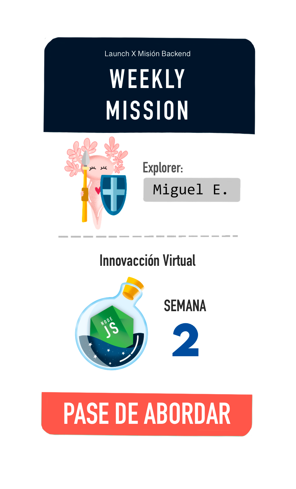

# Weekly Mission 2

Semana 2 y onBoarding

 1. ⭐️ Detalles 

 

# ⭐️ Objetivo

> En esta semana vamos a adentrarnos de lleno al lenguaje de JS, para ello es importante recordar que ya sabes lo primordial que es tener tus herramientas principales (línea de comando, control de versiones y tu editor de texto). Pues bien, esta semana nos adentraremos al lenguaje de JavaScript, particularmente en el uso de objetos, manipulación de estructuras de datos y orientación a objetos.

NOTA: Te recomiendo ir investigando tus propias dudas e inquietudes, y también te invito a que escribas de lo que vayas logrando o aprendiendo en el blog que creaste en el onboarding.

# 🏆 Aventuras por descubrir

- 🎯 Contextos
- 🎯 Objetos en JS
- 🎯 Operar listas y objetos
- 🎯 Clases y Objetos
- 🎯 Modularización de archivos
- 🎯 Pruebas Unitarias

 3. 📕 Referencias 

 

 1. [JS Mozilla](https://developer.mozilla.org/es/docs/Learn/JavaScript)
 2. [Eloquent JS](https://eloquentjavascript.net/)
 3. [EggHeadIo courses](https://egghead.io/q/javascript)
 4. [Frontend masters](https://frontendmasters.com/)

